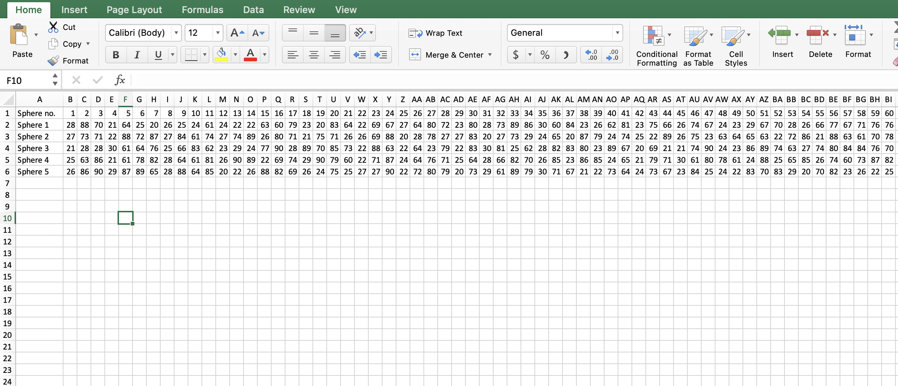
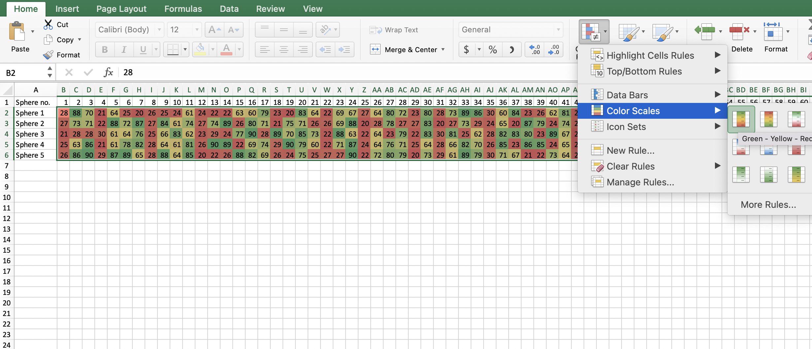
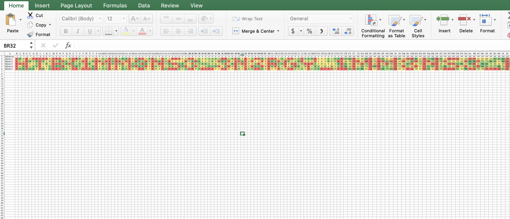

# Matrioshka Brain (Misc)

Not gonna lie, I played around with the numbers for quite some time looking for relationships between the temperatures and ASCII characters; I tried averaging each sphere's temp, standard deviation, the works... no luck.

Then I checked [Wikipedia](https://en.wikipedia.org/wiki/Matrioshka_brain) for a description of what a "Matrioshka Brain" was, and found this nugget:

>The innermost Dyson sphere of the matrioshka brain would draw energy directly from the star it surrounds and give off large amounts of waste heat while computing at a high temperature. The next surrounding Dyson sphere would absorb this waste heat and use it for its computational purposes, all while giving off waste heat of its own. This heat would be absorbed by the next sphere, and so on, with each sphere radiating at a lower temperature than the one before it.

In my head, I thought conditional formatting might be good to see if Sphere 2 was hotter than Sphere 1, Sphere 3 was hotter than Sphere 2, and so on.  Trying to experiment with different conditional fomatting formulas, I hovered over one of the presets and, by sheer accident, discovered the solution!

`HTB{1MM3NS3_3N3RGY_1MM3NS3_H34T}`
